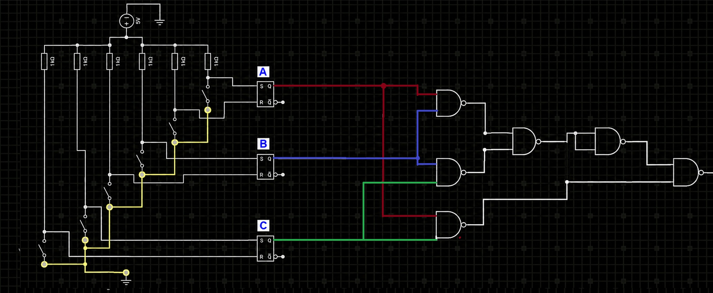
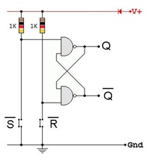
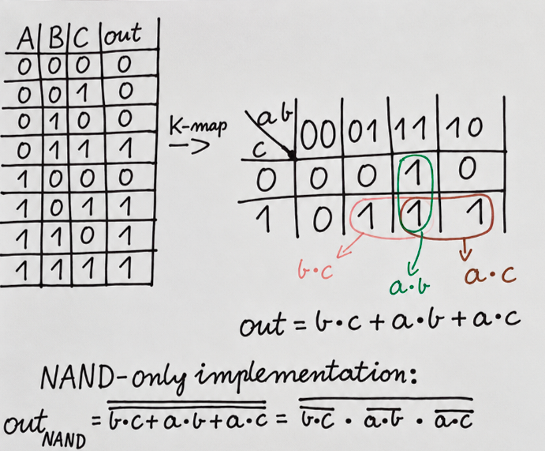
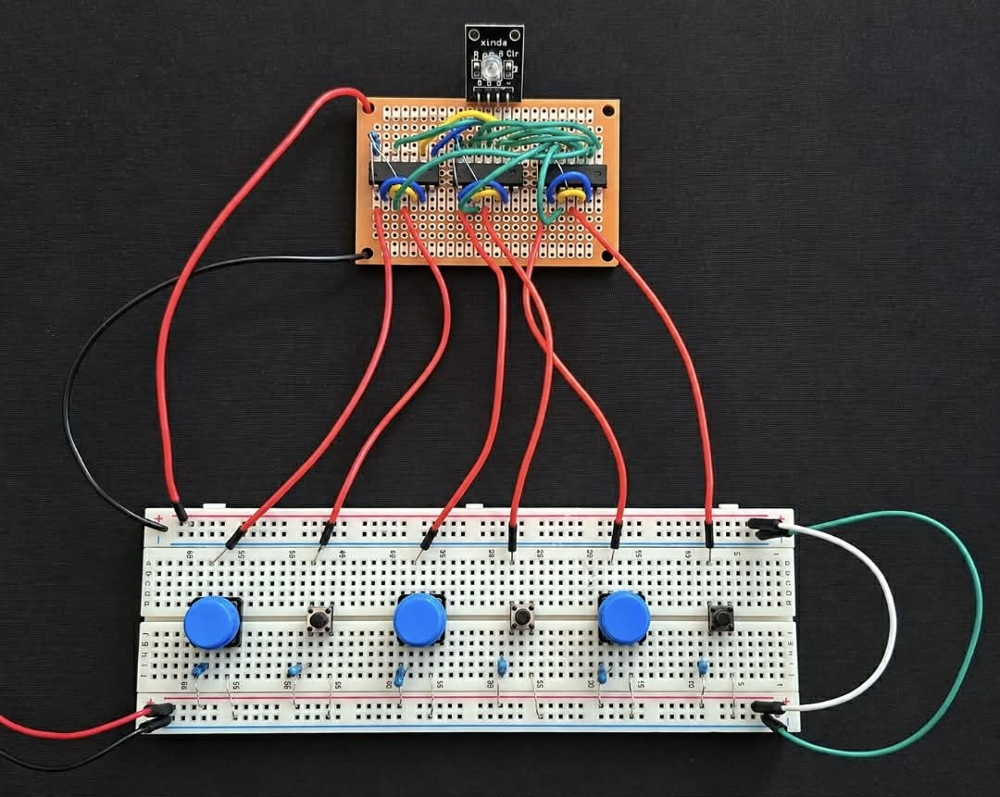
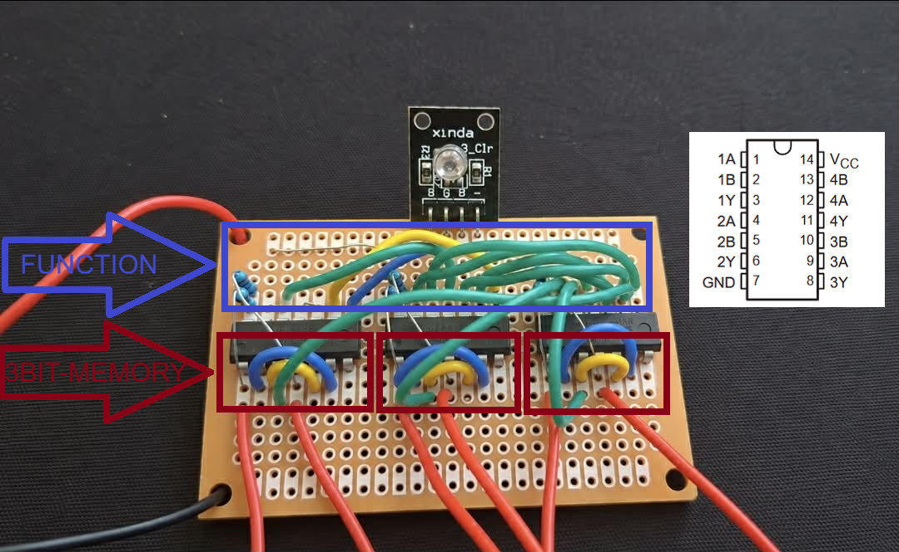
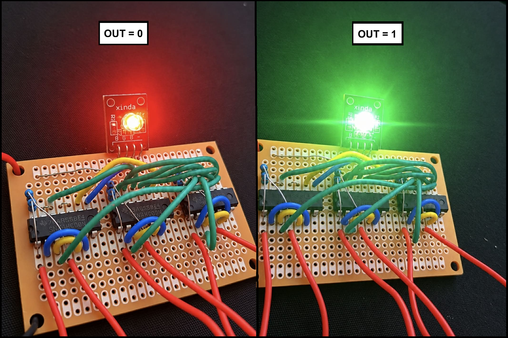

# 3-bit-nand-memory

3-bit hardware memory built from NAND RS latches with a Karnaugh-map-optimized 2-out-of-3 majority voter and RGB LED output.
The result is shown with an RGB LED:
Red — output 0
Green — output 1

SCHEME:

--------------------------------------------------------------------------------------------------------------------------------
## |3-bit memory|

The main part of the project is a 3-bit memory built from three asynchronous RS latches.

Each latch stores one bit:

RS latch A → bit A

RS latch B → bit B

RS latch C → bit C

The feedback inside each NAND latch keeps the selected state after the push button is released.

RS LATCH SCHEME:

--------------------------------------------------------------------------------------------------------------------------------
## |Majority voting logic|
The output is HIGH when at least two of the three stored bits are HIGH.

The function was simplified using a Karnaugh map:
Y = AB + AC + BC

Then it was transformed using De Morgan's law for a NAND-only implementation

CALCULATIONS:

--------------------------------------------------------------------------------------------------------------------------------- 
## Total NAND gate count

3 RS latches × 2 NAND gates = 6 NAND gates

majority voter = 6 NAND gates

Total: 12 two-input NAND gates
--------------------------------------------------------------------------------------------------------------------------------- 
The circuit was then assembled as a real hardware prototype using logic ICs, push buttons, resistors, wiring, and an RGB LED.

FINAL HARDWARE PROTOTYPE:

ASSEMBLED CIRCUIT IN TWO STATES OUT = 1/0:

--------------------------------------------------------------------------------------------------------------------------------- 
